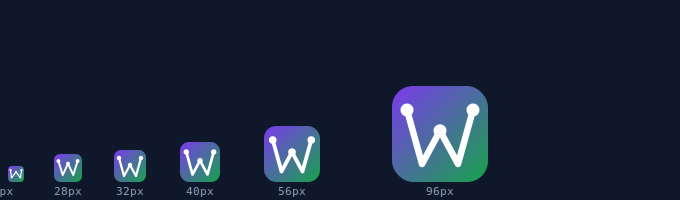

# InTheWild — Branding Guide

> **Owner:** Audrey Evans · MIDNGHTSAPPHIRE  
> **Last updated:** 2026-03-20

---

## 1. Current Brand — What's In the App

The branding is live, consistent, and fully centralised. Full inventory:

| Element | Current value | Location |
|---|---|---|
| **Product name** | InTheWild | `client/src/components/Logo.tsx` → `APP_NAME` |
| **Logo mark** | Custom ITW mark (see §2 below) | `client/src/components/Logo.tsx` → `ITWMark` |
| **Icon gradient** | `from-purple-500 to-green-500` | `client/src/components/Logo.tsx` → `ICON_GRADIENT` |
| **Text gradient** | `from-purple-400 to-green-400` | `client/src/components/Logo.tsx` → `TEXT_GRADIENT` |
| **Page background** | `from-purple-950 via-slate-900 to-green-950` | All pages, dark cinematic |
| **Primary tagline** | "Full-Stack From Soup To Nuts" | `Home.tsx` hero |
| **Secondary tagline** | "The Lovable Killer" | `Home.tsx` badge |
| **Favicon** | Same ITW mark, 32 × 32 SVG | `client/public/favicon.svg` |
| **Browser tab title** | "InTheWild — Full-Stack AI App Generator" | `client/index.html` |

> **To rebrand the entire app** — name, icon, colours — edit **one file only:**  
> `client/src/components/Logo.tsx`

---

## 2. The ITW Mark — Custom Logo

The app now uses a **purpose-built custom SVG mark** instead of a generic Lucide icon.

### Design

```
  ●           ●        ← circuit nodes (filled circles, r = 2.2)
   \         /
    \       /
     \  ●  /          ← centre-peak node
      \/  \/
      /\  /\
     /  \/  \
    /   /\   \        ← W valleys (open, no nodes)
   /   /  \   \
```

Rendered at all sizes used in the app:



### Anatomy

| Element | Description |
|---|---|
| **W letterform** | A single `<path>` stroke tracing the five points of the letter W |
| **Three circuit nodes** | Filled `<circle>` elements at the top-left, top-right, and centre-peak coordinates — where the W "reaches up" |
| **Rounded stroke caps** | `stroke-linecap="round"` gives organic warmth; valleys are cap-terminated (no node), keeping the mark light |
| **Container** | Rounded-square div with `bg-gradient-to-br from-purple-500 to-green-500` — the mark sits inside at full width with 6 px padding |

### Why this mark works

- **Unambiguous lettermark** — starts with the "W" from "Wild"; reads correctly at 16 px (smallest browser tab size)
- **Circuit-board metaphor** — three pads connected by copper traces; immediately communicates code / tech
- **Git-branch metaphor** — three nodes branching from a shared trunk; resonates with developers
- **Distinct silhouette** — the W + three dots is recognisable even as a blurred favicon thumbnail; no competitor uses it
- **No third-party dependency** — pure inline SVG; removes the Lucide `<Zap>` import entirely

### Coordinates (SVG viewBox `0 0 24 24`)

| Point | x | y | Has node? |
|---|---|---|---|
| Top-left tip | 2 | 4 | ✅ r = 2.2 |
| Left valley | 7 | 20 | — |
| Centre peak | 12 | 11 | ✅ r = 2.2 |
| Right valley | 17 | 20 | — |
| Top-right tip | 22 | 4 | ✅ r = 2.2 |

### Favicon coordinates (32 × 32 canvas, ≈ 6 px padding)

| Point | x | y |
|---|---|---|
| Top-left tip | 5 | 8 |
| Left valley | 10 | 26 |
| Centre peak | 16 | 15 |
| Right valley | 22 | 26 |
| Top-right tip | 27 | 8 |

---

## 3. Is the Branding Generic or Audience-Specific?

**Currently:** strong developer tone. "InTheWild" and "Soup to Nuts" land well with technical builders; the circuit-node mark reinforces the code/git metaphor.

**InTheWild has two distinct audience segments:**

### Segment A — Technical Builders (Indie Developers / Solo Founders)
- Want speed and completeness: "give me a real app, not a Figma mockup"
- Respond to: raw power language, anti-establishment framing ("Lovable Killer"), dark theme, circuit-board motifs
- Current brand fits this audience **well**

### Segment B — Non-Technical Entrepreneurs / Creators
- Want results without code knowledge: "I have an idea, build it"
- Respond to: approachable, empowering language, clear value proposition
- Current brand partially fits — "Soup to Nuts" may land as confusing jargon

---

## 4. Naming Options (by audience + genre)

The name `InTheWild` is strong — it implies production-ready, real-world deployment ("software out in the wild"). It also connects naturally to the **Revvel** music ecosystem (underground, unfiltered, raw). Consider keeping it.

If you ever want to pivot the brand per audience, here are options:

### For Developers (technical audience)
| Name | Vibe | Notes |
|---|---|---|
| **InTheWild** ✅ | Raw, production, real | Current — keep if staying developer-focused |
| **StackForge** | Power tool, craft | Implies building full stacks from scratch |
| **WildStack** | Hybrid — both audiences | Keeps "Wild" brand equity |
| **FullForge** | Complete, powerful | Communicates full-stack clearly |
| **AppForge** | Broad, accessible | Could work for non-technical users too |

### For Non-Technical Creators (broader audience)
| Name | Vibe | Notes |
|---|---|---|
| **BuildWild** | Creative, empowering | Action verb + brand equity |
| **Summon** | Magical, effortless | "Summon your app into existence" |
| **Scaffold** | Clear, useful | Very developer though |
| **Conjure** | Creative, fast | Appeals to non-technical creators |

### Connecting to Revvel Music Ecosystem
| Name | Vibe | Notes |
|---|---|---|
| **InTheWild** ✅ | Underground, real, unfiltered | Already fits Revvel's "no gatekeepers" ethos |
| **FullTrack** | Music + full-stack | Double meaning: full audio track + full tech stack |
| **MixStack** | Music production + tech | Could be confusing |

**Recommendation:** Keep `InTheWild`. It's distinctive, short, memorable, and fits both the developer audience and the Revvel brand identity. The risk is zero — no other major AI tool uses it.

---

## 5. Colour Tokens
```
Primary gradient: purple-500 (#a855f7) → green-500 (#22c55e)
Background:       purple-950 (#2e1065) via slate-900 (#0f172a) → green-950 (#052e16)
Accent light:     purple-400 / green-400
```

This palette is distinctive — it doesn't copy Vercel (black/white), Lovable (peach/pink), Cursor (dark grey), or Supabase (dark green). It's yours.

---

## 6. Tagline Options

| Tagline | Audience | Tone |
|---|---|---|
| "Full-Stack From Soup To Nuts" ✅ | Developers | Confident, comprehensive |
| "The Lovable Killer" ✅ | Developers | Aggressive positioning, memorable |
| "Your idea. A real app. In minutes." | Both | Clear, non-technical |
| "Generate apps, not excuses." | Developers | Cheeky, action-oriented |
| "From prompt to production." | Both | Clean, clear |
| "Built wild. Shipped fast." | Both | Energetic, brand-consistent |

**Recommendation:** Keep both current taglines for the dev-facing landing page. Add "Your idea. A real app. In minutes." as a secondary sub-headline if you want to reach non-technical users without changing the primary positioning.

---

## 7. How to Change the Name, Colours, or Mark

Everything is centralised in **one file:**

```
client/src/components/Logo.tsx
```

To change the **name or gradient colours**, edit these three constants:
```typescript
const ICON_GRADIENT = "from-purple-500 to-green-500";  // icon box background
const TEXT_GRADIENT = "from-purple-400 to-green-400";  // wordmark text gradient
const APP_NAME = "InTheWild";                           // the name shown everywhere
```

To change the **icon shape**, edit the `ITWMark` SVG component in the same file.  
The favicon (`client/public/favicon.svg`) uses its own copy of the mark — keep the two in sync when editing.

Page backgrounds and button gradients still use inline Tailwind classes across pages. A future clean-up could extract those to CSS custom properties in `client/src/index.css`.
